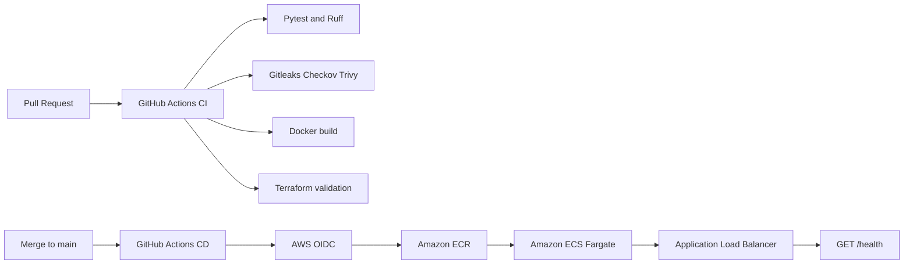

# AWS CI/CD Platform

Secure CI/CD pipeline for deploying a containerized Flask application to Amazon ECS Fargate using Terraform and GitHub Actions.

## Project objective

This project demonstrates how to deliver a containerized application to AWS through an automated and secured pipeline:

```text
Pull Request
    |
    v
Tests, linting and security checks
    |
    v
Merge to main
    |
    v
Docker build and vulnerability scan
    |
    v
Amazon ECR
    |
    v
Amazon ECS Fargate
    |
    v
ALB smoke test on /health
```

The main focus of this repository is the delivery platform, not the application itself.

## What this project demonstrates

- GitHub Actions CI/CD.
- AWS authentication through GitHub Actions OIDC.
- Short-lived AWS credentials instead of long-lived access keys.
- Terraform-managed AWS infrastructure.
- Remote Terraform state stored in encrypted Amazon S3.
- Native S3 state locking with `use_lockfile`.
- Immutable Amazon ECR image tags.
- ECS Fargate rolling deployment.
- Automated post-deployment validation.
- Secret scanning with Gitleaks.
- Terraform security scanning with Checkov.
- Container vulnerability scanning with Trivy.
- Least-privilege IAM permissions for deployment.

## Architecture



## Repository structure

```text
app/
├── app.py
├── Dockerfile
├── requirements.txt
├── requirements-dev.txt
└── tests/

terraform/
├── bootstrap/
└── environments/
    └── dev/

.github/
└── workflows/
    ├── pull-request.yml
    └── deploy-dev.yml

docs/
├── deployment-flow.md
└── rollback.md
```

## CI workflow

Pull Requests targeting `main` run:

1. Python dependency installation.
2. Pytest.
3. Ruff.
4. Docker image build.
5. Terraform format validation.
6. Terraform initialization without backend access.
7. Terraform validation.
8. Checkov Terraform security scan.
9. Gitleaks secret scan.
10. Trivy container vulnerability scan.

Pull Requests do not receive AWS credentials and do not push images to ECR.

## CD workflow

After a push to `main`, GitHub Actions:

1. Authenticates to AWS with OIDC.
2. Builds the Docker image.
3. Tags the image with the Git commit SHA.
4. Scans the image with Trivy.
5. Pushes the image to Amazon ECR.
6. Reads the current ECS task definition.
7. Replaces the container image with the new SHA-tagged image.
8. Registers a new ECS task definition revision.
9. Updates the ECS service.
10. Waits for ECS service stability.
11. Calls the ALB `/health` endpoint.

The deployment does not rely exclusively on the mutable `latest` tag.

## AWS authentication

The GitHub Actions role is assumed through the GitHub Actions OIDC identity provider.

The trust policy is restricted to:

- the expected GitHub repository;
- the `main` branch;
- the GitHub OIDC audience `sts.amazonaws.com`.

No long-lived AWS access key is stored in GitHub Secrets.

The only repository secret required by the deployment workflow is:

```text
AWS_ROLE_ARN
```

## Terraform state

The development environment uses an S3 backend:

```text
Bucket: aws-cicd-platform-tf-state-20100
Key: environments/dev/terraform.tfstate
Region: eu-west-3
Encryption: enabled
Locking: S3 native lockfile
```

The state bucket is versioned and protected from public access.

The bootstrap infrastructure must be created before initializing the development environment.

## Deployment commands

Bootstrap:

```bash
terraform -chdir=terraform/bootstrap init
terraform -chdir=terraform/bootstrap plan
terraform -chdir=terraform/bootstrap apply
```

Development environment:

```bash
terraform -chdir=terraform/environments/dev init
terraform -chdir=terraform/environments/dev plan
terraform -chdir=terraform/environments/dev apply
```

The application deployment itself is performed by GitHub Actions after a merge to `main`.

## Rollback

Rollback instructions are documented in:

```text
docs/rollback.md
```

A rollback consists of updating the ECS service to a previously known-good task definition revision.

## Destroy development resources

The development environment can be destroyed independently:

```bash
terraform -chdir=terraform/environments/dev destroy
```

Do not destroy the bootstrap resources unless the Terraform state bucket, ECR repository and OIDC provider are no longer needed.

See the project documentation before destroying resources.

## Cost considerations

This project is designed as a low-cost demonstration environment.

To reduce cost:

- destroy the development environment when it is not being used;
- avoid leaving Fargate tasks running unnecessarily;
- remove unused networking resources;
- keep the ECR repository lifecycle limited;
- monitor NAT Gateway usage if one is present;
- do not deploy production-sized infrastructure.

## Limitations

This is a portfolio and learning project, not a production platform.

It does not currently include:

- multi-environment promotion;
- blue/green deployment;
- automated approval gates for production;
- centralized observability dashboards;
- SAST beyond the configured repository and IaC checks;
- private networking for every CI component.

## Related projects

This project complements:

- a serverless AWS API provisioned with Terraform;
- a highly available containerized AWS web platform.

Together, these projects demonstrate serverless architecture, container platforms, infrastructure as code, CI/CD and cloud security.